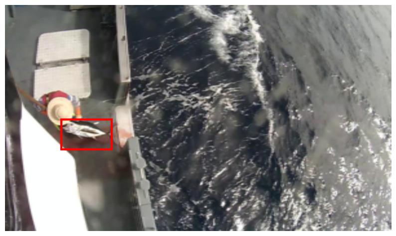

# Fish Localization and Classification with ResNet50

This project tackles the **localization** and **classification** of tuna fish species using deep learning techniques. The goal is to accurately detect the presence of a fish in an image, draw a bounding box around it, and classify it into one of the six known species.
> **Note**: This project was developed as part of a deep learning course assignment.

## Dataset

The dataset used in this project comes from the [Nature Conservancy Fisheries Monitoring Challenge on Kaggle](https://www.kaggle.com/competitions/the-nature-conservancy-fisheries-monitoring).

- Images are organized into folders corresponding to **six distinct fish species**.
- Number of classes: 8
- An `OTHER` folder contains images of species **not among the six primary categories**.
- The `NOF` folder contains images where **no fish are present**.
- The `annos` folder contains the **bounding box annotations** for each fish-containing image.
- Input image size: 299x299
- Annotations format: JSON files

Bounding box annotations are parsed using the `read_annotations()` function and are used to compare the predicted boxes with the ground truth.

### Sample Images with Bounding Boxes

> Red rectangles indicate the true fish locations provided in the annotation data.

## Model

The model used for both localization and classification is **ResNet50**, a deep convolutional neural network pretrained on ImageNet and fine-tuned for this specific task.

A ResNet50 model is modified to:
- Output 8 class scores
- Output 4 values for bounding box localization (r1, c1, r2, c2)

The final layer has 12 outputs: 8 (classes) + 4 (bounding box).

### Performance

- **Training Accuracy**: 99%
- **Validation Accuracy**: 97%

## Sample Result

Below is a sample prediction showing the predicted bounding box (red) and the input image:

